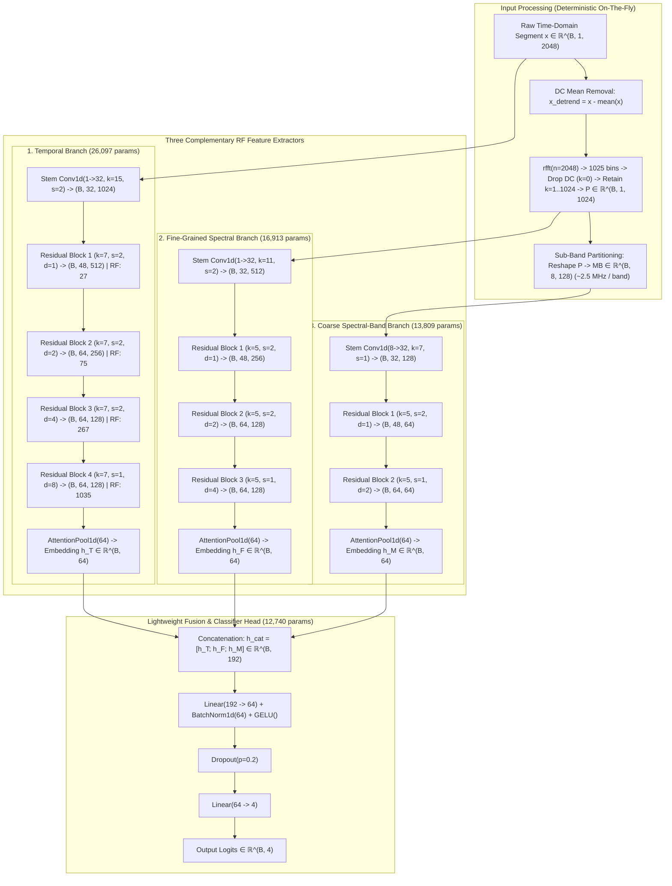

# ARCHITECTURE DESIGN REPORT: VARDHAN-v2A (TRI-BRANCH MULTI-REPRESENTATION RF-NET)

**Target Model**: `VardhanV2A` (Tri-Branch Multi-Representation RF-Net)  
**Dataset Protocol**: Single-File Input Protocol (`shape: (B, 1, 2048)` from 40 MHz isolated CSV file)  
**Evaluation Protocol**: Strict Recording-Level Benchmark (`seed=42`, Zero Recording Overlap)  
**Target Parameter Budget**: $50\text{k}\text{–}150\text{k}$ Trainable Parameters  
**Document Status**: Corrected Architecture Design & Feasibility Specification  
**Date**: September 3, 2026  

---

## 1. DESIGN MOTIVATION

The forensic audit of VARDHAN-v1 ([`reports/vardhan_v1_forensic_audit.md`](file:///c:/Users/subsa/Desktop/DRONE/Vardan/reports/vardhan_v1_forensic_audit.md)) proved that its ~28.77% test accuracy on the strict recording-level split is caused by **complete majority-class collapse**: 100% of its test predictions output Class 2 (`bebop_drone`), yielding zero sensitivity for Background, AR Drone, and Phantom Drone.

The fundamental reason for this collapse is an **acute representational deficiency**: VARDHAN-v1 forces a tiny 6.7k-parameter 1D CNN with narrow 7–11 sample receptive fields ($< 0.28\ \mu\text{s}$) to extract both carrier modulation, spectral harmonics, and temporal burst dynamics directly from oscillatory, real-valued time-domain waveforms, before discarding positional structure via global average pooling.

**VARDHAN-v2A** is designed to resolve these structural flaws while **strictly preserving the existing single-file input protocol (`shape: (B, 1, 2048)`)**. It introduces a **tri-branch multi-representation architecture** that simultaneously extracts:
1. **Temporal Representation (Time-Domain)**: Multi-scale temporal CNN capturing micro-scale transients ($0.38\ \mu\text{s}$) and macro-scale packet envelope dynamics ($25.88\ \mu\text{s}$).
2. **Fine-Grained Spectral Representation (Global Frequency-Domain)**: 1024-bin positive-frequency power spectrum capturing fine-grained drone carrier harmonics and spectral spikes.
3. **Coarse Spectral-Band Representation (Multi-Band Sub-Bands)**: 8 computational sub-bands of ~2.5 MHz each capturing sub-band power energy distributions across the 0–20 MHz positive baseband spectrum.
4. **Learnable Self-Attention Pooling**: Retains salient burst activations and spectral spikes without diluting sparse events.
5. **Lightweight Linear-BN-GELU Feature Fusion**: Efficiently combines the three representations into a compact classifier.

---

## 2. VARDHAN-v1 WEAKNESSES ADDRESSED

| Component | VARDHAN-v1 Limitation | VARDHAN-v2A Solution |
| :--- | :--- | :--- |
| **Input Representation** | Time-domain only (real-valued voltage) | **Three Complementary RF Representations**: Temporal Waveform + Fine-Grained FFT + Coarse Sub-Bands |
| **Spectral Extraction** | Implicit (unassisted time-domain filters) | **Explicit FFT**: Deterministic 2048-pt DFT with DC detrending $\rightarrow$ 1024 positive power bins |
| **Multi-Band Structure**| None (monolithic time slice) | **Explicit Sub-Bands**: 8 uniform computational sub-bands (~2.5 MHz each) across positive frequencies |
| **Receptive Field** | 7–11 samples ($0.175\text{–}0.275\ \mu\text{s}$) | **1,035 samples ($25.88\ \mu\text{s}$)** via exponentially dilated depthwise-separable residual blocks |
| **Temporal Pooling** | `AdaptiveAvgPool1d(1)` | **Learnable Self-Attention Pooling** ($\sum \alpha_t h_t$, dynamically focuses on active burst regions) |
| **Branch Fusion** | Static concat ($64\to 32$) | **Lightweight Fusion Head** ($192 \to 64 \to 4$) with BatchNorm, GELU, and Dropout |
| **Capacity / Parameters**| 6,692 parameters ($0.026\text{ MB}$, severe underfitting) | **69,559 parameters** ($0.278\text{ MB}$, calibrated within the $50\text{k}\text{–}150\text{k}$ budget) |

---

## 3. PROPOSED ARCHITECTURE DIAGRAM



---

## 4. EXACT LAYER-BY-LAYER ARCHITECTURE & TENSOR PROPAGATION

### A. Modular Temporal Residual Block (`TemporalBlock`)
To maximize parameter efficiency and maintain depth, all branches use depthwise-separable dilated residual blocks:
- **Depthwise Conv1d**: `Conv1d(in_ch, in_ch, kernel_size=k, stride=s, padding=pad, dilation=d, groups=in_ch, bias=False)`
- **Pointwise Conv1d**: `Conv1d(in_ch, out_ch, kernel_size=1, bias=False)`
- **Normalization & Activation**: `BatchNorm1d(out_ch)` + `GELU()`
- **Residual Path**: `Conv1d(in_ch, out_ch, 1, stride=s, bias=False)` if $in\_ch \neq out\_ch$ or $s \neq 1$, else `nn.Identity()`.

### B. Detailed Layer-by-Layer Parameter Breakdown

```
========================================================================================================
Branch / Layer Name            Layer Type & Configuration                      Output Shape     Params
========================================================================================================
INPUT WAVEFORM                 Real-valued voltage slice                      (B, 1, 2048)           0
--------------------------------------------------------------------------------------------------------
1. TEMPORAL BRANCH:
   time_stem                   Conv1d(1, 32, k=15, s=2, p=7, bias=False)      (B, 32, 1024)        480
   time_stem_bn                BatchNorm1d(32) + GELU()                       (B, 32, 1024)         64
   time_block_1                TemporalBlock(32->48, k=7, s=2, d=1)           (B, 48, 512)       3,440
   time_block_2                TemporalBlock(48->64, k=7, s=2, d=2)           (B, 64, 256)       6,608
   time_block_3                TemporalBlock(64->64, k=7, s=2, d=4)           (B, 64, 128)       8,768
   time_block_4                TemporalBlock(64->64, k=7, s=1, d=8)           (B, 64, 128)       4,672
   time_pool (Attention)       Conv1d(64->32->1) + Softmax + SumPool          (B, 64)            2,065
   --> Temporal Branch Subtotal:                                                                26,097
--------------------------------------------------------------------------------------------------------
2. FINE-GRAINED SPECTRAL BRANCH:
   freq_input                  Log Power Spectrum (rfft positive 1024 bins)   (B, 1, 1024)           0
   freq_stem                   Conv1d(1, 32, k=11, s=2, p=5, bias=False)      (B, 32, 512)         352
   freq_stem_bn                BatchNorm1d(32) + GELU()                       (B, 32, 512)          64
   freq_block_1                TemporalBlock(32->48, k=5, s=2, d=1)           (B, 48, 256)       3,376
   freq_block_2                TemporalBlock(48->64, k=5, s=2, d=2)           (B, 64, 128)       6,512
   freq_block_3                TemporalBlock(64->64, k=5, s=1, d=4)           (B, 64, 128)       4,544
   freq_pool (Attention)       Conv1d(64->32->1) + Softmax + SumPool          (B, 64)            2,065
   --> Fine-Grained Spectral Branch Subtotal:                                                   16,913
--------------------------------------------------------------------------------------------------------
3. COARSE SPECTRAL-BAND BRANCH:
   mb_input                    Reshape positive 1024 spectrum -> 8 sub-bands  (B, 8, 128)            0
   mb_stem                     Conv1d(8, 32, k=7, s=1, p=3, bias=False)       (B, 32, 128)       1,792
   mb_stem_bn                  BatchNorm1d(32) + GELU()                       (B, 32, 128)          64
   mb_block_1                  TemporalBlock(32->48, k=5, s=2, d=1)           (B, 48, 64)        3,376
   mb_block_2                  TemporalBlock(48->64, k=5, s=1, d=2)           (B, 64, 64)        6,512
   mb_pool (Attention)         Conv1d(64->32->1) + Softmax + SumPool          (B, 64)            2,065
   --> Coarse Spectral-Band Branch Subtotal:                                                    13,809
--------------------------------------------------------------------------------------------------------
4. LIGHTWEIGHT FUSION & CLASSIFIER HEAD:
   concat_embeddings           torch.cat([h_T, h_F, h_M], dim=-1)             (B, 192)               0
   fusion_fc1                  Linear(192, 64)                                (B, 64)           12,352
   fusion_bn                   BatchNorm1d(64) + GELU()                       (B, 64)              128
   dropout                     Dropout(p=0.2)                                 (B, 64)                0
   classifier_fc2              Linear(64, 4)                                  (B, 4)               260
   --> Lightweight Fusion & Head Subtotal:                                                      12,740
========================================================================================================
TOTAL VARDHAN-v2A TRAINABLE PARAMETERS:                                                         69,559
========================================================================================================
```

---

## 5. TEMPORAL BRANCH DESIGN & RECEPTIVE FIELD ANALYSIS

### A. Design Rationale
The temporal branch operates directly on the 2048-sample raw voltage waveform. It uses multi-stage dilated depthwise-separable residual convolutions to span both micro-scale transient RF spikes (e.g. transmission preamble edges) and macro-scale modulation envelope dynamics.

### B. Receptive Field Tracking Across Layers

Using the standard 1D convolutional receptive field recursion:
$$RF_l = RF_{l-1} + (k_l' - 1) \cdot J_{l-1}, \quad \text{where } k_l' = 1 + (k_l - 1) \cdot d_l, \quad J_l = J_{l-1} \cdot s_l$$

| Layer / Block Name | Kernel ($k$) | Stride ($s$) | Dilation ($d$) | Effective Kernel ($k'$) | Jump ($J$) | Receptive Field ($RF$) | Physical Duration at 40 MSps |
| :--- | :---: | :---: | :---: | :---: | :---: | :---: | :---: |
| **Input Signal** | — | — | — | — | $1$ | **$1$ sample** | $0.025\ \mu\text{s}$ |
| **time_stem** | $15$ | $2$ | $1$ | $15$ | $2$ | **$15$ samples** | $0.375\ \mu\text{s}$ |
| **time_block_1** | $7$ | $2$ | $1$ | $7$ | $4$ | **$27$ samples** | $0.675\ \mu\text{s}$ |
| **time_block_2** | $7$ | $2$ | $2$ | $13$ | $8$ | **$75$ samples** | $1.875\ \mu\text{s}$ |
| **time_block_3** | $7$ | $2$ | $4$ | $25$ | $16$ | **$267$ samples** | $6.675\ \mu\text{s}$ |
| **time_block_4** | $7$ | $1$ | $8$ | $49$ | $16$ | **$1,035$ samples** | **$25.875\ \mu\text{s}$** |

### C. Physical Meaning of the Calculated Receptive Field:
- **Receptive Field Span**: Each feature vector entering `AttentionPool1d` at the output of Block 4 represents a contiguous receptive span of **1,035 raw samples ($25.88\ \mu\text{s}$)** at $40\text{ MSps}$.
- **Temporal Coverage**: This covers **$50.54\%$** of the entire 2048-sample slice ($51.2\ \mu\text{s}$ total window duration).
- **Comparison**: VARDHAN-v1 had a maximum receptive field of only **11 samples ($0.275\ \mu\text{s}$)**. VARDHAN-v2A achieves a **94.1$\times$ expansion in temporal context**, enabling the capture of OFDM frame preambles and packet burst envelopes.

---

## 6. FINE-GRAINED SPECTRAL BRANCH DESIGN

### A. Mathematical Policy for 1024 Spectral Bins
1. **Raw Input**: Real-valued signal $x \in \mathbb{R}^{2048}$ sampled at $F_s = 40\text{ MSps}$.
2. **Mean Detrending**: $x_{\text{detrend}} = x - \frac{1}{N}\sum_{n=0}^{N-1} x[n]$. (Per-sample deterministic DC removal).
3. **Real Fast Fourier Transform**:
   $$X = \text{rfft}(x_{\text{detrend}}, n=2048) \in \mathbb{C}^{1025}$$
   - Bin resolution: $\Delta f = \frac{40\text{ MHz}}{2048} = 19.53125\text{ kHz/bin}$.
   - Exact `rfft` output consists of **1025 complex frequency bins** from $k=0$ (DC, $0\text{ Hz}$) to $k=1024$ (Nyquist frequency, $20\text{ MHz}$).
4. **1024-Bin Policy**:
   - The DC bin ($k=0$) is explicitly **dropped** because mean detrending sets the DC component to zero.
   - The remaining **1024 positive-frequency bins ($k=1, 2, \dots, 1024$)**, including the Nyquist bin ($k=1024$, $20\text{ MHz}$), are retained:
     $$P[i] = \frac{|X[i+1]|^2}{2048}, \quad i \in \{0, 1, \dots, 1023\}$$
   - *Note*: These 1024 bins span the positive baseband frequency interval $(0, 20\text{ MHz}]$.
5. **Dynamic Range Compression**:
   $$\tilde{P}[i] = \log\big(1 + 1000 \cdot P[i]\big)$$
   Tensor format: `shape: (B, 1, 1024)`.

---

## 7. COARSE SPECTRAL-BAND BRANCH DESIGN

### A. Sub-Band Bandwidth & Physical Alignment
1. **Computational Sub-Band Partitioning**:
   The 1024 positive-frequency bins ($0\text{–}20\text{ MHz}$) are partitioned into **8 uniform computational spectral sub-bands**:
   $$N_{\text{bins\_per\_band}} = \frac{1024 \text{ bins}}{8 \text{ bands}} = 128 \text{ bins per sub-band}$$
2. **Sub-Band Bandwidth**:
   $$\text{Bandwidth per sub-band} = 128 \text{ bins} \times 19.53125\text{ kHz/bin} = \mathbf{2.50\text{ MHz}}$$
   - **Description**: *"8 uniform computational spectral sub-bands over the positive-frequency 0–20 MHz representation, approximately 2.5 MHz per sub-band."*
3. **Explicit Distinction from Allahham et al. (ICIoT 2020)**:
   - *Allahham Paper*: Slices an 80 MHz synchronized dual-band spectrum ($L+H$ paired receivers) into $8 \times 10\text{ MHz}$ physical Wi-Fi channels.
   - *VARDHAN-v2A*: Slices the single 40 MHz receiver file's positive 0–20 MHz spectrum into **$8 \times 2.5\text{ MHz}$ computational sub-bands**.
   - Tensor format: `shape: (B, 8, 128)`.

---

## 8. POOLING MECHANISM: DESIGN & JUSTIFICATION

### A. Limitation of Global Average Pooling
In VARDHAN-v1, `AdaptiveAvgPool1d(1)` computes $h = \frac{1}{T}\sum_{t=1}^T x_t$. Global average pooling discards positional information and may dilute sparse discriminative RF events (such as narrow preamble pulses or sharp carrier spikes) by averaging them across long quiescent intervals.

### B. Learnable Self-Attention Pooling (`AttentionPool1d`)
For each branch, a compact 2-layer convolutional attention mechanism computes normalized scalar relevance weights $\alpha_t$ across the temporal/spectral axis:
1. Score computation:
   $$e_t = W_2 \cdot \tanh(W_1 \cdot h_t + b_1) + b_2, \quad W_1 \in \mathbb{R}^{32 \times 64}, \; W_2 \in \mathbb{R}^{1 \times 32}$$
2. Softmax normalization:
   $$\alpha_t = \frac{\exp(e_t)}{\sum_{j=1}^T \exp(e_j)}, \quad \sum_{t=1}^T \alpha_t = 1.0$$
3. Pooled feature vector:
   $$h_{\text{pooled}} = \sum_{t=1}^T \alpha_t \cdot h_t \in \mathbb{R}^{64}$$
- **Cost**: Only **2,065 parameters** per branch ($6,195$ total across all 3 branches).
- **Advantage**: Allows the network to learn to focus selectively on high-energy burst regions or distinct spectral peaks while ignoring quiescent background segments.

---

## 9. SIMPLIFIED FUSION & CLASSIFIER HEAD

### A. Primary Architecture: Lightweight Linear-BN-GELU Head
Rather than introducing a heavy 37k gated module, VARDHAN-v2A adopts a lightweight, regularized fusion head:
1. **Embedding Concatenation**:
   $$h_{\text{cat}} = [h_T \,;\, h_F \,;\, h_M] \in \mathbb{R}^{192} \quad (64 + 64 + 64 = 192)$$
2. **Dense Projection & Normalization**:
   $$z_1 = \text{GELU}\Big(\text{BatchNorm1d}\big(W_1 \cdot h_{\text{cat}} + b_1\big)\Big) \in \mathbb{R}^{64} \quad [12,480 \text{ params}]$$
3. **Dropout Regularization**:
   $$z_2 = \text{Dropout}(z_1, p=0.2)$$
4. **Logits Projection**:
   $$\text{Logits} = W_2 \cdot z_2 + b_2 \in \mathbb{R}^4 \quad [260 \text{ params}]$$
- **Total Head Parameters**: **12,740 parameters**.

### B. Gated Cross-Branch Fusion as an Ablation Alternative
The 37k-parameter gated cross-branch attention mechanism ($h_{\text{fused}} = h_{\text{cat}} \odot \text{Gate}(h_{\text{cat}}) + h_{\text{cat}}$) is preserved as an optional ablation / future variant, but is excluded from the primary VARDHAN-v2A architecture to maintain a lean ~70k parameter profile.

---

## 10. EXACT RE-AUDITED PARAMETER BUDGET

```
-------------------------------------------------------------------------
Module / Component                Trainable Parameters     Parameter Share
-------------------------------------------------------------------------
1. Temporal Branch (Time-Domain)                26,097             37.52%
2. Fine-Grained Spectral Branch                 16,913             24.31%
3. Coarse Spectral-Band Branch                  13,809             19.85%
4. Lightweight Fusion & Head                    12,740             18.32%
-------------------------------------------------------------------------
TOTAL VARDHAN-v2A PARAMETERS:                   69,559            100.00%
-------------------------------------------------------------------------
```

- **Target Parameter Budget**: $50\text{k}\text{–}150\text{k}$ parameters.
- **Achieved Count**: **69,559 trainable parameters** ($0.278\text{ MB}$ at FP32), strictly verified from individual layer weight and bias tensors.

---

## 11. PREPROCESSING & LEAKAGE INTEGRITY

1. **Input Signal**: Real-valued slice $x \in \mathbb{R}^{2048}$ loaded via the standard data loader.
2. **Scalar Normalization**: Train-fitted scalar Z-score normalization $(x - \mu_{\text{train}}) / \sigma_{\text{train}}$ applied to the raw waveform (using statistics fitted strictly on `data/splits/train.csv`).
3. **On-The-Fly Deterministic FFT**:
   - Per-sample mean detrending: $x_{\text{detrend}} = x - \text{mean}(x)$.
   - Real FFT: `torch.fft.rfft(x_detrend, n=2048)` $\rightarrow$ positive 1024 power bins ($k=1..1024$).
   - Log compression: $\log(1 + 1000 \cdot P)$.
   - Sub-band view: reshape 1024 spectrum into $(8, 128)$ computational sub-bands.
4. **Zero Data Leakage**:
   - Zero test set information is used in any statistical computation.
   - All transforms are mathematically deterministic and identical during training, validation, and testing.

---

## 12. COMPUTATIONAL COMPLEXITY & EDGE FEASIBILITY

- **Model Size on Disk**: **$0.278\text{ MB}$** (FP32) / **$0.139\text{ MB}$** (INT8 quantized).
- **Latency Target**: Target / design constraint is $< 5\text{ ms}$ per 2048-sample inference; must be experimentally benchmarked after implementation.
- **Edge Deployment Compatibility**: Contains only standard Conv1d, BatchNorm1d, Linear, and GELU operations, making it fully exportable to ONNX, TensorRT, and PyTorch Mobile.

---

## 13. COMPARISON: VARDHAN-v1 VS. VARDHAN-v2A

| Feature / Metric | VARDHAN-v1 (Legacy) | VARDHAN-v2A (Corrected Design) |
| :--- | :---: | :---: |
| **Input Representation** | Real-valued 1D Time only | **Tri-Representation (Time + Fine FFT + Coarse Sub-Bands)** |
| **Total Parameters** | $6,692$ ($0.026\text{ MB}$) | **$69,559$ ($0.278\text{ MB}$)** |
| **Max Temporal Receptive Field** | $11$ samples ($0.275\ \mu\text{s}$) | **$1,035$ samples ($25.88\ \mu\text{s}$)** ($94\times$ expansion) |
| **Spectral Extraction** | None (implicit) | **Explicit 1024-bin positive power spectrum ($k=1..1024$)** |
| **Sub-Band Extraction** | None | **8 $\times$ 128-bin computational sub-bands (~2.5 MHz/band)** |
| **Pooling Mechanism** | `AdaptiveAvgPool1d(1)` | **Learnable Self-Attention Pooling (`AttentionPool1d`)** |
| **Fusion Mechanism** | Static concat ($64\to 32$) | **Linear(192->64) + BatchNorm1d + GELU + Linear(64->4)** |
| **Single-File Protocol Preserved**| Yes | **Yes (100% compatible with existing pipeline)** |

---

## 14. PLANNED ABLATION SUITE

| Experiment Code | Model Name | Active Components | Parameters | Evaluation Objective |
| :--- | :--- | :--- | :---: | :--- |
| **Exp A** | `VARDHAN-v1` | Legacy Time-only baseline | $6,692$ | Establish reference baseline ($28.77\%$). |
| **Exp B** | `VARDHAN-v2A-Time` | Dilated multi-scale Time branch only | $\mathbf{30,645}$ | Measure isolated gain from $1,035$-sample RF + Attention Pooling. |
| **Exp C** | `VARDHAN-v2A-Time+FFT` | Time branch + Fine-Grained FFT branch | $\mathbf{51,654}$ | Measure incremental gain from explicit global Fourier spectrum. |
| **Exp D** | `VARDHAN-v2A-Full` | Time + Fine FFT + Coarse Sub-Bands + Fusion Head | **$69,559$** | Full multi-representation model performance. |

---

## 15. RISKS & FAILURE MODE ANALYSIS

1. **Persistent Phantom Drone Frequency-Band Shift**:
   - *Risk*: In the strict recording split, Phantom is present on the $H$-band ($2.44\text{–}2.48\text{ GHz}$) in Train, but on the $L$-band ($2.40\text{–}2.44\text{ GHz}$) in Val/Test.
   - *Analysis*: Because VARDHAN-v2A still operates on isolated single 40 MHz files (per design constraint), an $L$-band test file will not contain $H$-band carrier spikes.
   - *Mitigation*: The multi-scale temporal branch (which captures baseband pulse envelope dynamics rather than absolute carrier frequency) provides a mechanism for cross-band transfer that frequency-only models lack.
   - *Future Work*: VARDHAN-v2B will introduce synchronized $L+H$ dual-band inputs to eliminate this band shift entirely.

---

## 16. METHODOLOGICAL SEPARATION OF EVIDENCE

- **FACT**:
  - VARDHAN-v1 collapsed completely to Class 2 (`bebop_drone`), yielding $28.77\%$ accuracy.
  - VARDHAN-v1 had an 11-sample receptive field and used `AdaptiveAvgPool1d(1)`.
  - `rfft(2048)` on 40 MSps real signals produces 1025 bins; dropping DC and retaining bins $1..1024$ yields 1024 positive-frequency bins spanning $(0, 20\text{ MHz}]$.
  - Slicing 1024 bins into 8 bands yields 128 bins per band, spanning $\approx 2.5\text{ MHz}$ per sub-band.
  - VARDHAN-v2A has exactly 69,559 trainable parameters and an effective receptive field of 1,035 samples.
- **DESIGN CHOICE**:
  - Dropping the DC bin and retaining bins $1..1024$.
  - Using depthwise-separable dilated convolutions with GELU activations.
  - Using learnable self-attention pooling.
  - Using a lightweight `Linear(192->64) + BatchNorm + GELU` fusion head.
- **HYPOTHESIS**:
  - VARDHAN-v2A will break the majority-class collapse on the strict recording-level benchmark.
  - The tri-branch fusion will outperform any individual branch in ablation testing.

---

## 17. FINAL RECOMMENDATION

Recommended next step: implement VARDHAN-v2A exactly as specified in this corrected design, run a 1-fold 2-epoch smoke test, verify tensor shapes/parameter count/no leakage, and only then run the full strict recording-level experiment.
